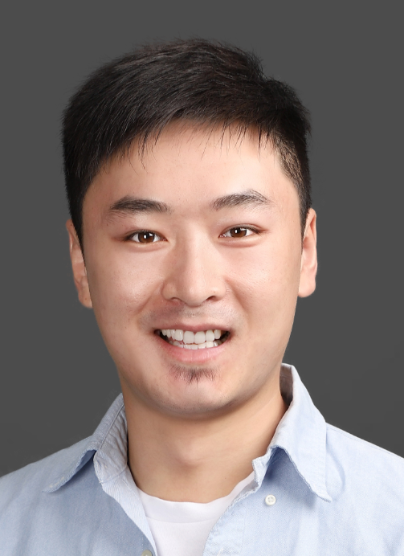

# Peng Yang (杨鹏)

Ph.D

[Curriculum Vitae](PengYangCV.pdf)

Email: trevor@mail.ustc.edu.cn | yangpeng64@huawei.com

Address: Huawei Technologies CO., LTD., Hangzhou, China.

---
## Brief CV

I am a senior engineer at the IT Algorithm Department of Huawei Technologies CO., LTD., China. Before that, I received the Bachelor Degree and Ph.D Degree (Supervisors: Prof. Xin Yao and Prof. Ke Tang) in Computer Science from University of Science and Technology of China at 2012 and 2017, respectively.

### Experience
* 2017.7 - present: **Senior Engineer**, IT Algorithm Department, Huawei Technologies CO., LTD., China
* 2012.9 - 2017.6: **Research Assistant**, USTC-Birmingham Joint Research Institute in Intelligent Computation and Its Applications (UBRI), University of Science and Technology of China, China
* 2015.10.4 - 2015.10.24: **Visiting Student**, National Institute of Informatics, Japan
* 2014.7 - 2015.1: **Visiting Student**, The Centre of Excellence for Research in Computational Intelligence and Applications (CERCIA), University of Birmingham, U.K.
* 2013.11 - 2014.5: **Visiting Student**, The Intelligent Systems Group, University of Basque Country, Spain

---

## Research Interest

My research mainly focuses on Evolutionary Computation (EC) and its Applications. As one of the main complementary techniques, EC is widely acknowledged as a family of powerful tools for non-differentiable complex optimization problems that mathematical methods or gradient based approaches are ill-equiped to deal with. Currently, I am particularly intersted in EC-based approaches on:

1. Large-scale optimization problems
2. Multi-modal optimization problems
3. QoS in cloud computing

---

## Publications
### Referred Journal Publications
1. *Peng Yang*, Ke Tang and Xin Yao. Turning High-dimensional Optimization into Computationally Expensive Optimization. **IEEE Transactions on Evolutionary Computation**, DOI: 10.1109/TEVC. 2017.2672689, in press.
2. Jinhong Zhong, *Peng Yang*, Ke Tang. A Quality-Sensitive Method for Learning from Crowds. **IEEE Transactions on Knowledge and Data Engineering**, Vol. 29, Issue 12, pp. 2643-2654, 2017.
3. *Peng Yang*, Ke Tang and Xiaofen Lu. Improving Estimation of Distribution Algorithm on Multi-modal Problems by Detecting Promising Areas. **IEEE Transactions on Cybernetics**, Vol. 45, Issue 8, pp. 1438-1449, 2015.
4. *Peng Yang*, Ke Tang, Jose A. Lozano and Xianbin Cao. Path Planning for Single Unmanned Aerial Vehicle by Separately Evolving Waypoints. **IEEE Transactions on Robotics**, Vol. 31, Issue 5, pp. 1130-1146, 2015
5. Ke Tang, *Peng Yang* and Xin Yao. Negatively Correlated Search. **IEEE Journal on Selected Areas in Communications**, Vol. 34, Issue 3, pp. 1-9, March 2016. 

### Referred Conference Publications
1. *Peng Yang*, Guanzhou Lu, Ke Tang and Xin Yao. A Multi-Modal Optimization Approach to Single Path Planning for Unmanned Aerial Vehicle. In: **Proceedings of the 2016 IEEE Congress on Evolutionary Computation (CEC2016)**, pp.1735-1742, Vancouver, Canada; 07/2016, IEEE.
2. *Peng Yang*, Ke Tang and Jose A. Lozano. Estimation of Distribution Algorithms based Unmanned Aerial Vehicle Path Planner Using a New Coordinate System. In: **Proceedings of the 2014 IEEE Congress on Evolutionary Computation (CEC2014)**, pp.1469-1476, Beijing, China; 07/2014, IEEE.
3. *Peng Yang*, Ke Tang, Lingxi Li and Kai Qin. Evolutionary Robust Optimization with Multiple Solutions. In: **Proceedings of The 18th Asia Pacific Symposium on Intelligent and Evolutionary Systems**, Nov., 2015, Singapore; pp.611-625, Springer.
4. Wenjing Hong, Guanzhou Lu, *Peng Yang*, Yong Wang and Ke Tang. A New Evolutionary Multi- objective Algorithm for Convex Hull Maximization. In: **Proceedings of the 2015 IEEE Congress on Evolutionary Computation (CEC2015)**, pp.931-938, Sendai, Japan; 05/2015, IEEE.  

---

## Awards

* Special Prize of Presidential Scholarship of Chinese Academy of Sciences, 2017
* Excellent Graduate Student of Anhui Province, 2017
* Excellent Graduate Student of University of Science and Technology of China, 2017
* Guorui Scholarship, 2016
* IEEE Computational Intelligence Society Outstanding Student Paper Travel Grants, 2016
* Microsoft Research Asia Fellowship (Nomination Award), 2015
* USTC-Institute of Advanced Manufacturing Technology Scholarship, 2015
* IEEE Computational Intelligence Society Graduate Student Research Grants, 2015
* National Scholarship for Graduate Students, 2014

---

## Professonal Services

**Journal Reviewer**
* IEEE Transactions on Evolutionary Computation
* IEEE Transactions on Industrial Electronics
* Information Sciences
* Memetic Computing
* Natural Computing
* Swarm and Evolutionary Computation
* Journal of Systemics, Cybernetics, and Informatics (JSCI)

**Conference PC member**
* The 7th IEEE Symposium Series on Computational Intelligence (SSCI’16)
* The 19th World Multi-Conference on Systemics, Cybernetics And Informatics (WMSCI’15)

---
The End
